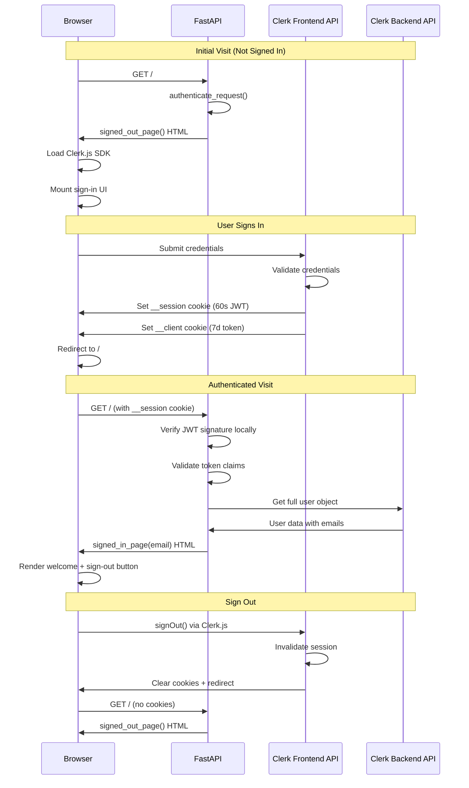

# Air Demo Repository - Technical Understanding

## Project Overview

This repository contains minimal examples demonstrating [Air](https://feldroy.github.io/air/) framework patterns for building AI-ready web applications.

**Air Documentation**: https://feldroy.github.io/air/

## Examples

### 1. Background Tasks (`background-tasks/`)
Contrasts HTMX polling vs SSE for background job progress updates.

### 2. Database Form (`database-form/`)
Form validation with SQLModel and SQLite persistence. Uses SQLModel ORM with synchronous sessions (not air.ext.sqlmodel which doesn't exist in current Air versions).

### 3. Clerk Authentication (`clerk_auth/`)
Minimal FastAPI application demonstrating authentication using:
- **Air**: Python HTML generation framework built on FastAPI
- **Clerk**: Modern authentication platform with prebuilt UI components
- **Python Clerk SDK**: Backend session verification

## How clerk_auth/main.py Works

### Architecture

The application creates a single-page authentication flow with two states:
1. **Signed Out**: Shows Clerk's sign-in UI component
2. **Signed In**: Shows welcome page with user email and sign-out button

### Key Components

#### Environment Setup (Lines 19-24)
```python
load_dotenv(Path(__file__).with_name(".env"))
PUBLISHABLE_KEY = os.environ["NEXT_PUBLIC_CLERK_PUBLISHABLE_KEY"]
SECRET_KEY = os.environ["CLERK_SECRET_KEY"]
```

Requires two Clerk API keys:
- `NEXT_PUBLIC_CLERK_PUBLISHABLE_KEY`: Client-side key for Clerk JavaScript SDK
- `CLERK_SECRET_KEY`: Server-side key for verifying authentication

#### Clerk JavaScript Integration

The app uses Clerk's browser SDK loaded from CDN (line 24):
```python
CLERK_JS_SRC = "https://cdn.jsdelivr.net/npm/@clerk/clerk-js@5/dist/clerk.browser.js"
```

Two JavaScript snippets handle authentication:

**SIGN_IN_SCRIPT (Lines 29-45)**: 
- Waits for DOM load and Clerk initialization
- Redirects to home if already signed in
- Mounts Clerk's prebuilt sign-in UI component to `#sign-in` div
- Configures redirect to `/` after successful authentication

**AUTH_SCRIPT (Lines 48-61)**:
- Sets up sign-out button click handler
- Calls `Clerk.signOut()` with redirect back to home

#### Request Conversion Helper (Lines 64-71)

```python
async def _to_httpx_request(request: Request) -> httpx.Request
```

Converts FastAPI's `Request` object to `httpx.Request` format required by Clerk's `authenticate_request()` method. This bridges FastAPI and Clerk SDK's different request representations.

#### Email Extraction (Lines 73-84)

```python
def _extract_primary_email(user: Any) -> str
```

Extracts the user's primary email address from Clerk's User object:
1. Attempts to find email matching `primary_email_address_id`
2. Falls back to first email address if primary not found
3. Returns empty string if no emails exist

Uses `getattr()` for safe attribute access since Clerk SDK objects are dynamically typed.

#### HTML Generation Functions

**_clerk_script() (Lines 87-93)**:
Returns Air Script tag with:
- Clerk browser SDK source URL
- `async_` loading
- CORS configuration
- `data-clerk-publishable-key` attribute for initialization

**_signed_out_page() (Lines 95-105)**:
Returns full HTML page using Air's `mvpcss` layout with:
- Page title
- Heading and instructions
- Empty `#sign-in` div (Clerk UI will mount here)
- Clerk SDK script tag
- Sign-in initialization script

**_signed_in_page() (Lines 108-119)**:
Returns authenticated user page with:
- Welcome heading
- User's email address display
- Sign-out button with event handler
- Clerk SDK and auth script tags

#### Main Route Handler (Lines 122-139)

```python
@app.get("/")
async def home(request: Request) -> air.Html
```

The core authentication logic:

1. **Convert request** to httpx format for Clerk SDK
2. **Extract origin** from request URL for security validation
3. **Authenticate request** using Clerk SDK:
   ```python
   state = sdk.authenticate_request(
       httpx_request,
       AuthenticateRequestOptions(authorized_parties=[origin])
   )
   ```
   - Verifies JWT signature from `__session` cookie
   - Validates token expiration and authorized party
   - Returns `RequestState` with authentication status

4. **Check authentication state**:
   - If `state.is_signed_in` is False: Return sign-in page
   - If signed in: Fetch user data and return welcome page

5. **Fetch user details**:
   ```python
   user_id = getattr(state, "user_id", None) or state.payload.get("sub")
   user = sdk.users.get(user_id=user_id)
   ```
   - Extracts user ID from either `state.user_id` attribute or JWT `sub` claim
   - Makes API call to Clerk to get full user object
   - Extracts email and renders signed-in page

### Authentication Flow



## Technology Deep Dive

### Air Framework

**What it is**: Python HTML generation library built on FastAPI that lets you write HTML as Python classes instead of templates.

**Key concepts**:
- **Tags**: Python classes representing HTML elements (`air.H1()`, `air.Div()`, etc.)
- **AirResponse**: Default response class that automatically converts tags to HTML
- **Layouts**: Helper functions like `air.layouts.mvpcss()` for quick page structure
- **Safety**: Auto-escapes content except for `Raw()`, `Script()`, and `Style()` tags

**Example**:
```python
air.Html(
    air.Head(air.Title("My Page")),
    air.Body(
        air.H1("Welcome", class_="header"),
        air.P("This is ", air.Strong("bold"), " text")
    )
)
```

**Benefits for this demo**:
- Type-safe HTML generation with IDE autocomplete
- No template syntax errors at runtime
- Easy to compose reusable components as Python functions
- Seamless FastAPI integration

### Clerk Authentication

**What it is**: Full-stack authentication platform providing prebuilt UI components and session management.

**Architecture**:
- **Frontend API (FAPI)**: Handles user-facing auth flows (sign-in, sign-up, sessions)
- **Backend API (BAPI)**: Server-side operations (user management, verification)
- **Hybrid tokens**: Long-lived client token (7d) + short-lived session JWT (60s)

**Session Token (JWT) Claims**:
```json
{
  "sub": "user_123",           // User ID
  "sid": "sess_456",           // Session ID
  "iss": "https://clerk.example.com",
  "azp": "https://example.com",  // Authorized party (origin)
  "exp": 1713158400,           // Expiration (60s from issue)
  "iat": 1713158340            // Issued at
}
```

**Security model**:
1. Short JWT expiration (60s) limits attack window for stolen tokens
2. Background refresh every 50s maintains seamless user session
3. Server-side session records enable revocation within ~60s
4. JWT signature verification ensures token hasn't been tampered with
5. Authorized party (`azp`) validation prevents cross-origin token reuse

### Clerk Python SDK

**Core method**: `authenticate_request(request, options)`

**What it does**:
1. Extracts token from `__session` cookie or `Authorization` header
2. Verifies JWT signature using Clerk's public key (RS256 algorithm)
3. Validates claims: expiration, not-before, authorized party
4. Returns `RequestState` with authentication status and user claims

**RequestState object**:
```python
state.is_signed_in          # bool: Authentication status
state.payload               # dict: JWT claims (sub, sid, exp, etc.)
state.user_id               # str: User ID (if available)
state.status                # AuthStatus enum
state.reason                # Error reason if not signed in
```

**Users API**:
After authentication, fetch full user details:
```python
user = sdk.users.get(user_id="user_123")
user.email_addresses        # List of email address objects
user.primary_email_address_id
user.username
user.first_name
user.last_name
```

### HTMX (Not Used in This Demo)

While Air has built-in HTMX support, this demo uses Clerk's JavaScript SDK directly for authentication UI. However, HTMX could be used for dynamic interactions:

**Common patterns**:
- `hx-get="/data"`: Make GET request on trigger event
- `hx-target="#results"`: Which element to update with response
- `hx-swap="innerHTML"`: How to insert response HTML
- `hx-trigger="click"`: What event triggers the request

**Example with Air + HTMX**:
```python
air.Button(
    "Load More",
    hx_get="/items",
    hx_target="#item-list",
    hx_swap="beforeend"
)
```

## Running the Demo

```bash
# Navigate to clerk_auth directory
cd clerk_auth

# Create .env file with Clerk keys
cat > .env <<EOF
NEXT_PUBLIC_CLERK_PUBLISHABLE_KEY=pk_test_...
CLERK_SECRET_KEY=sk_test_...
EOF

# Run with FastAPI dev server
fastapi dev main.py
```

The application will be available at http://localhost:8000.

## Code Patterns to Follow

### When building similar auth features:

1. **Always validate authorized parties** in authentication options to prevent cross-origin token abuse

2. **Use context managers** for Clerk SDK to ensure proper resource cleanup:
   ```python
   with Clerk(bearer_auth=SECRET_KEY) as sdk:
       state = sdk.authenticate_request(...)
   ```

3. **Handle missing user attributes safely** with getattr and fallbacks:
   ```python
   user_id = getattr(state, "user_id", None) or state.payload.get("sub")
   ```

4. **Separate Air component functions** for reusability:
   ```python
   def _clerk_script() -> air.Script
   def _signed_out_page() -> air.Html
   def _signed_in_page(email: str) -> air.Html
   ```

5. **Load Clerk SDK asynchronously** to avoid blocking page load:
   ```python
   air.Script(src=CLERK_JS_SRC, async_=True)
   ```

6. **Wait for Clerk.load()** before accessing Clerk objects:
   ```javascript
   await window.Clerk.load()
   if (window.Clerk.user) { /* ... */ }
   ```

## Potential Extensions

- Add protected routes that require authentication
- Implement organization-based access control using Clerk orgs
- Use HTMX for dynamic content updates without full page reloads
- Add Air forms with Pydantic validation for user profile updates
- Implement session middleware for DRY authentication checks
- Add user metadata fields and custom claims
- Integrate with database using SQLModel for user-specific data

## Dependencies

From `pyproject.toml`:
- `air`: HTML generation framework
- `clerk-backend-api`: Clerk Python SDK for authentication
- `python-dotenv`: Environment variable loading
- `httpx`: HTTP client (required by Clerk SDK)
- `fastapi`: Web framework (Air's foundation)
